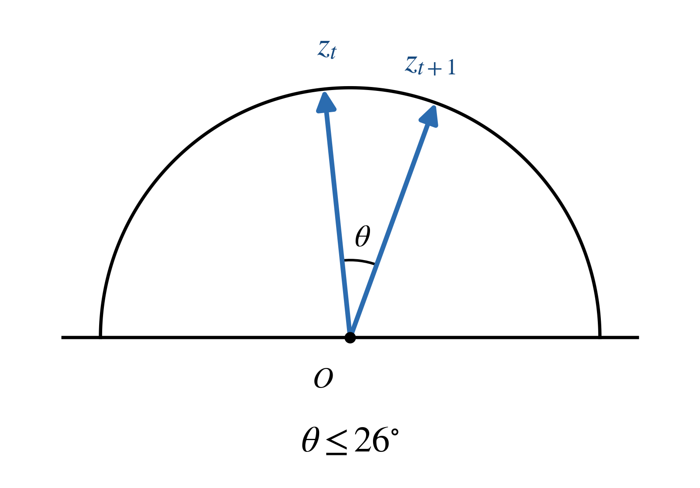
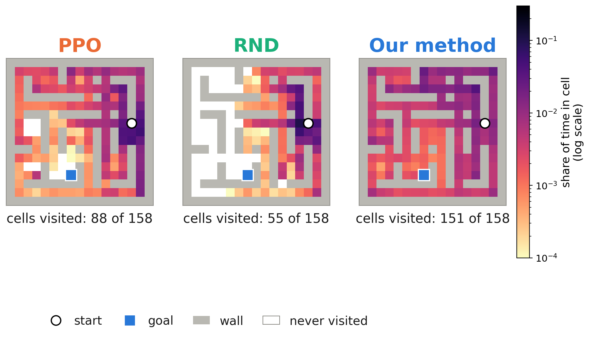
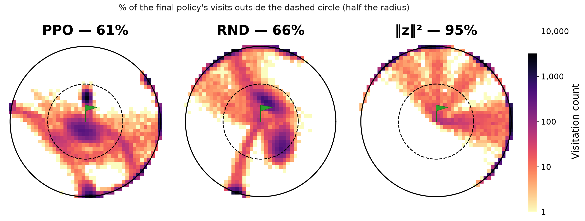

# Isotropic Coverage: Engineering Curiosity with a Gaussian Map

**Rohan Bankapur**

This repository is a clean, standalone release of **IsoCover**, a method for
giving a reinforcement learning agent a built-in sense of curiosity: reward
it for reaching parts of its own experience that its internal map currently
treats as rare. It ships the method's code (a learned map, its losses, the
`||z||^2` intrinsic reward, and a PPO trainer), configs for the exact
hyperparameters the project's final DMLab and Atari runs used, and tests
that check the public code against the private research code it was
extracted from.

This README assumes you are comfortable with code but not necessarily with
the math; every symbol is defined in plain language before it is used.

## Table of contents

- [The idea, in plain language](#the-idea-in-plain-language)
- [The temporal loss, and why it is needed](#the-temporal-loss-and-why-it-is-needed)
- [What is in this repository](#what-is-in-this-repository)
- [Install](#install)
- [Quickstart](#quickstart)
- [Configs](#configs)
- [Reproduce our results](#reproduce-our-results)
- [What this release simplifies, compared with the research code](#what-this-release-simplifies-compared-with-the-research-code)
- [Results](#results)
- [Citing](#citing)
- [License](#license)

## The idea, in plain language

A reinforcement learning agent gets *extrinsic* reward from the task (reach
the goal, collect the key). In a game where that reward is rare or absent for
a long time, the agent also needs an *intrinsic* reward: a reason to keep
exploring even when nothing has paid off yet.

IsoCover builds that intrinsic reward out of a learned **map**: a neural
network, called an encoder, that looks at the agent's current observation
(a frame of pixels) and outputs a point `z` in a `d`-dimensional space
(`d = 1024` in every final run here). Call this map `phi`, so `z = phi(observation)`.

The map is trained so that the cloud of points it produces, over everything
the agent has seen, looks like a **standard Gaussian** (a bell curve):
centered at the origin, spread out equally in every direction, with no
preferred axis. This is what "isotropic" means: the same in every direction.
The loss that pushes the map toward this shape is called **SIGReg**
(sliced isotropic Gaussian regularizer; see `isocover/sigreg.py`), and it is
checked the cheap way: instead of verifying the whole `d`-dimensional cloud
is Gaussian directly, it projects the cloud onto many random one-dimensional
directions and checks that EACH of those projections looks like an ordinary
1-D bell curve. A theorem (Cramer-Wold) guarantees that if every 1-D
projection is Gaussian, the whole `d`-dimensional cloud is too.

Once the map's output is (approximately) a standard Gaussian, there is a
clean rule connecting "distance from the center" to "how rare this point is."
For a standard Gaussian, the probability density at a point `z` is

```
p(z) is proportional to exp(-||z||^2 / 2)
```

where `||z||^2` is the squared length of the vector `z` (sum of the squares
of its coordinates). Taking the logarithm of both sides (the Gaussian's
"change of variables" relationship between density and distance):

```
-log p(z) = ||z||^2 / 2 + a constant
```

The left-hand side, `-log p(z)`, is the standard mathematical definition of
**rarity** (sometimes called "surprisal"): a point with low probability has
a large negative-log-probability. The equation says that rarity and squared
distance from the center are, up to a constant, the SAME NUMBER. So:

> **The intrinsic reward is `||z||^2`**: reward the agent for reaching
> observations whose map point is far from the center, i.e. observations the
> map currently treats as rare.

This is implemented in `isocover/reward.py`. No separate "novelty detector"
network is trained (contrast Random Network Distillation, which trains a
second predictor network and rewards its prediction error): the reward is
read directly off the geometry of a representation the map is already being
trained to keep Gaussian.

Crucially, nothing about this reward depends on any privileged information.
The map is trained only on observations the agent has actually experienced
(never on data an oracle constructed, see the "no privileged data" note
below), so curiosity here means "surprising to ME, given what I have seen,"
not "surprising according to some outside ground truth."

## The temporal loss, and why it is needed

SIGReg alone only constrains the overall SHAPE of the cloud of `z` points; it
says nothing about how the map moves from one frame to the next. Left alone,
SIGReg would be perfectly happy with a map that scrambles consecutive frames
to unrelated, far-apart points, as long as the overall cloud still looks
Gaussian. That would make `||z||^2` a bad curiosity signal: it could jump
around wildly even when the agent barely moved.

The **temporal loss** (`isocover/temporal.py`) fixes this by penalizing large
changes in DIRECTION between consecutive map points, measured from the
origin (the center the Gaussian, and the point curiosity measures distance
from):

<p align="center">= 0.9)."></p>

A step from `z_t` to `z_{t+1}` should not swing the angle `theta` between
them (as seen from the origin `O`) by very much. This is motivated by a
simple geometric fact (the reverse triangle inequality): a single step cannot
change a vector's LENGTH by more than the step's own length, and the same
geometry bounds the change in DIRECTION too: the longer `z_t` already is from
the origin, the smaller a step of a given size can swing its angle. So
bounding the angle asks that the map be locally smooth in direction, which
keeps the `||z||^2` curiosity bonus from swinging wildly frame to frame.

Concretely, the **cosine-hinge loss** penalizes only once the cosine of that
angle drops below a threshold `tau = 0.9` (about 26 degrees, matching the
diagram above):

```
penalty = mean over moved steps of max(0, tau - cos(theta))
```

weighted by `0.003` in the final recipe. "Moved" steps are detected from the
raw pixels themselves (a step whose pixel change exceeds 0.2 times the
batch's own mean pixel change), so a blocked move into a wall carries no
penalty; this never uses privileged simulator state.

For the 2D latent-game recipe, two more terms are added:
- a **combined cosine-variance term** (weight `0.005`) that asks every step's
  turning angle be roughly the SAME SIZE everywhere on the map, not merely
  small everywhere;
- a **dynamics loss** (weight `0.1`, `isocover/dynamics.py`): a small MLP
  predicts `z_{t+1}` from `(z_t, one_hot(action_t))`, trained by mean-squared
  error, with NO stop-gradient: the gradient reaches the map's parameters
  through both `z_t` (the predictor's input) and `z_{t+1}` (the target). This
  pushes the map toward a representation where the agent's own actions have a
  learnable, consistent effect.

## What is in this repository

```
isocover/
  sigreg.py       SIGReg: the sliced isotropic Gaussian loss (sw2 variant)
  temporal.py     the cosine-hinge and cosine-variance temporal losses
  dynamics.py     the dynamics loss (z_t, action_t) -> z_{t+1}
  encoder.py      the convolutional map architecture (64x64 DMLab / 84x84 Atari)
  map_loss.py     SigRegMapLoss: combines the above with the final-recipe weights
  reward.py       the ||z||^2 intrinsic reward and its running normalization
  ppo.py          recurrent PPO with two value heads (extrinsic, intrinsic), GAE
  seeding.py      explicit, reproducible seeding utilities
  envs/
    dmlab.py      a fixed DeepMind Lab 3D maze, vectorized
    atari.py      Montezuma's Revenge / Venture, vectorized
scripts/
  pretrain_walk.py   collect a random walk and warm-start the map on it
  train.py           train PPO with ||z||^2, or the plain PPO baseline
  evaluate.py        evaluate a trained checkpoint: score and coverage
configs/
  dmlab_3d.yaml      the final recipe for the DMLab 3D maze, cited from its source run
  atari_2d.yaml      the final recipe for Montezuma's Revenge / Venture, cited from its source run
tests/
  test_parity.py         numerical parity against the original research code (skipped if absent)
  test_sigreg.py, test_temporal.py, test_dynamics.py, test_reward.py, test_ppo.py
  test_reproducibility.py   same seed -> identical results
docs/figures/        the figures referenced in this README
```

Scope: this release covers the method itself (the map, its losses, the
`||z||^2` reward, and PPO) on DMLab and Atari (Montezuma's Revenge, Venture).
It ships exactly two arms: `zsq` (the method) and `ppo` (the baseline,
intrinsic off). Every experimental option, ablation arm, whitening/batchnorm
variant, alternative SIGReg statistic, wandb-specific code, cluster path, and
plotting script from the research codebase has been dropped; see
[What this release simplifies](#what-this-release-simplifies-compared-with-the-research-code).

## Install

Python 3.11. The versions below are pinned to what the project's own final
runs used.

```bash
python -m venv .venv
source .venv/bin/activate
pip install -r requirements.txt
```

`requirements.txt` installs PyTorch, NumPy, SciPy, Gymnasium, and `ale-py`.
Two pieces need a separate, manual install:

**DeepMind Lab** (for the 3D maze). DeepMind Lab is not on PyPI; it is built
from source with Bazel. Follow the official build instructions:
https://github.com/deepmind/lab/blob/master/docs/build.md . The research runs
used a headless, software-rendered (OSMesa) build; `isocover/envs/dmlab.py`
passes `use_pbos='false'`, which is the flag that build needs to avoid a GL
pixel-buffer-object error on a machine with no system EGL/GL.

**Atari ROMs** (for Montezuma's Revenge / Venture). `ale-py` ships the
emulator but not the ROMs. You need to own the ROMs; a common path is the
Atari ROM collection distributed for research use via
[AutoROM](https://github.com/Farama-Foundation/AutoROM):

```bash
pip install autorom
AutoROM --accept-license
```

Check the install:

```bash
python -c "import torch, ale_py; print(torch.__version__, ale_py.__version__)"
python -c "import deepmind_lab; print('deepmind_lab OK')"
```

## Quickstart

Warm-start the map on a random walk (see the method section: no privileged
data, only a uniform-random-action walk from the target environment), then
train PPO with the `||z||^2` reward, then evaluate:

```bash
# 1. Pretrain the map on a random walk (DMLab maze 999)
python scripts/pretrain_walk.py --env dmlab --maze-seed 999 \
    --latent-dim 1024 --steps 4000 --out checkpoints/dmlab_maze999_walk.pt

# 2. Train (short smoke run; see "Reproduce our results" for the full budget)
python scripts/train.py --env dmlab --maze-seed 999 --arm zsq --seed 0 \
    --total-steps 50000 --enc-init-ckpt checkpoints/dmlab_maze999_walk.pt \
    --logdir runs/dmlab_zsq_s0

# 3. Evaluate
python scripts/evaluate.py --env dmlab --maze-seed 999 --arm zsq \
    --ckpt runs/dmlab_zsq_s0/ckpt_final.pt --episodes 20
```

The PPO baseline (intrinsic off, no map at all) needs no pretraining step:

```bash
python scripts/train.py --env dmlab --maze-seed 999 --arm ppo --seed 0 \
    --total-steps 50000 --logdir runs/dmlab_ppo_s0
```

## Configs

`configs/dmlab_3d.yaml` and `configs/atari_2d.yaml` list the exact
hyperparameter values the project's real final runs used, each commented
with the exact `config.json` of the run it was read from. The short version:

| | DMLab 3D maze | Atari (Montezuma / Venture) |
|---|---|---|
| map dimension `d` | 1024 | 1024 |
| SIGReg | `sw2`, weight `0.2`, 1024 slices | same |
| temporal (cosine-hinge) | weight `0.003`, `tau = 0.9` | same |
| combined cosine-variance | weight `0.005` | weight `0.005` |
| dynamics loss | **off** (`0.0`) | weight `0.1` |
| map warm start | 4,000 steps, random walk | same |
| map EMA rate | `1.0` (no smoothing: live map) | same |
| policy input | map embedding only, no separate pixel path | same |
| PPO | `num_envs=64`, `num_steps=128`, `epochs=4`, `num_minibatches=4`, `lr=1e-4` | same |
| discounts | `gamma_ext=0.999`, `gamma_int=0.99`, `gae_lambda=0.95` | same |
| advantage coefficients | `ext_coef=2.0`, `int_coef=1.0`, combined then normalized once | same |
| total steps | 1,000,000 | 40,000,000 (Montezuma) / 30,000,000 (Venture) |

The dynamics loss is off for DMLab (its action set is look/strafe/move, not
the clean small discrete skill set the 2D games have) and on for Atari.

## Reproduce our results

Commands below use the configs above; flags not shown use `scripts/train.py`'s
defaults, which already match the final recipe. Hardware/time figures are
the real final runs' own wall-clock times (single NVIDIA A100 GPU, 64 CPU
cores, `--num-envs 64`); your own time will vary with GPU and environment
rendering speed.

**1. Warm-start the map** (a few minutes on one GPU; not separately logged by
the original runs, since it is a small fraction of the total run time):

```bash
# DMLab maze 999
python scripts/pretrain_walk.py --env dmlab --maze-seed 999 \
    --latent-dim 1024 --steps 4000 --seed 0 \
    --out checkpoints/dmlab_maze999_walk_s0.pt

# Montezuma's Revenge
python scripts/pretrain_walk.py --env atari --atari-task montezuma \
    --latent-dim 1024 --steps 4000 --seed 0 \
    --out checkpoints/montezuma_walk_s0.pt
```

**2. Train.** DMLab maze 999, seeds 0-9, ~1,000,000 steps, ~13 minutes per
seed on one A100 (the real run: 999,424 / 1,000,000 steps in 762.85 s):

```bash
for seed in 0 1 2 3 4 5 6 7 8 9; do
  python scripts/pretrain_walk.py --env dmlab --maze-seed 999 \
      --latent-dim 1024 --steps 4000 --seed $seed \
      --out checkpoints/dmlab_maze999_walk_s$seed.pt
  python scripts/train.py --env dmlab --maze-seed 999 --arm zsq --seed $seed \
      --total-steps 1000000 --dyn-weight 0.0 \
      --enc-init-ckpt checkpoints/dmlab_maze999_walk_s$seed.pt \
      --logdir runs/dmlab_zsq_maze999_s$seed
  python scripts/train.py --env dmlab --maze-seed 999 --arm ppo --seed $seed \
      --total-steps 1000000 --logdir runs/dmlab_ppo_maze999_s$seed
done
```

Montezuma's Revenge, seeds 0-9, 40,000,000 steps, ~6h40m per seed on one A100
(the real run: 39,993,344 / 40,000,000 steps in 24,020 s):

```bash
for seed in 0 1 2 3 4 5 6 7 8 9; do
  python scripts/pretrain_walk.py --env atari --atari-task montezuma \
      --latent-dim 1024 --steps 4000 --seed $seed \
      --out checkpoints/montezuma_walk_s$seed.pt
  python scripts/train.py --env atari --atari-task montezuma --arm zsq --seed $seed \
      --total-steps 40000000 --dyn-weight 0.1 \
      --enc-init-ckpt checkpoints/montezuma_walk_s$seed.pt \
      --logdir runs/montezuma_zsq_s$seed
done
```

Venture uses the same commands with `--atari-task venture --total-steps 30000000`
(the real run: 29,999,104 / 30,000,000 steps in 18,021 s, ~5h on one A100).

**3. Evaluate:**

```bash
python scripts/evaluate.py --env dmlab --maze-seed 999 --arm zsq \
    --ckpt runs/dmlab_zsq_maze999_s0/ckpt_final.pt --episodes 50

python scripts/evaluate.py --env atari --atari-task montezuma --arm zsq \
    --ckpt runs/montezuma_zsq_s0/ckpt_final.pt --episodes 50
```

**Reproducibility.** `--seed` seeds Python, NumPy, and Torch (CPU and CUDA),
and every environment worker gets its own sub-seed derived from `--seed`
(`isocover/seeding.py`'s `derive`, a stable SHA-256-based hash, not Python's
per-process-salted `hash()`). `--deterministic` additionally asks cuDNN for
deterministic convolution algorithms (`cudnn.deterministic=True`), which is
slower and does not by itself guarantee bit-identical results across
different GPU models or CUDA/cuDNN versions, nor does it cover every op (see
`tests/test_reproducibility.py`, which checks the parts of this package that
ARE guaranteed bit-identical given a seed: `isocover.seeding` itself, the map
loss on a fixed batch, and one PPO update on a fixed synthetic rollout, all
on CPU). Every run directory's `config.json` records the fully resolved
arguments, the derived sub-seeds, the git commit (if available), and the
installed package versions.

## What this release simplifies, compared with the research code

The research trainer (not included here)
is about 4,000 lines supporting dozens of ablations, alternative SIGReg
statistics, whitening variants, replay-buffer options, and cluster-specific
plumbing. This release keeps only the final recipe and simplifies its
surrounding machinery:

- **Map-training triple buffer.** The original trainer kept a large
  cross-rollout ring buffer (typically 500k-1,000,000 steps) to sample
  consecutive-frame triples for the map's own training step. This release
  samples triples only from the CURRENT rollout (`--num-steps` x `--num-envs`
  steps), which is smaller and a real, documented difference in the exact
  sampling distribution, though the quantity of data per map-training step
  (`--enc-batch x --enc-updates-per-ppo-update`) is the same order of
  magnitude as one rollout.
- **Advantage normalization.** Only the "combined" mode (normalize once,
  after combining the extrinsic and intrinsic advantages) is implemented,
  since it is the mode every final run in this project used; the research
  trainer's "per_stream" mode (normalize each stream before combining) is not
  reproduced here.
- **No whitening, no alternative SIGReg statistics (Cramer-von Mises,
  Epps-Pulley), no batch-renormalization ablation, no ArcTan temporal
  metric, no METRA-style geometry losses, no importance-weighted rewards.**
  The final recipe uses `sw2` SIGReg and the cosine metric only; this release
  implements exactly that.
- **No wandb, no cluster/sbatch integration, no plotting code.**

## Results

All numbers are 10 independent training seeds per method, scored with the
same evaluation for every method. Significance uses the Mann-Whitney U test,
Holm-corrected across six comparisons (the four below plus two on a third
game, MiniHack, not included in this release).

**Montezuma's Revenge** (game score, shipped `configs/atari_2d.yaml`):

| method | mean score | median | seeds with score > 0 |
|---|---|---|---|
| `||z||^2` (this method) | 221.7 | 227.3 | 7 / 10 |
| RND | 20.6 | 0.0 | 4 / 10 |
| PPO | 0.0 | 0.0 | 0 / 10 |

`||z||^2` vs PPO: p = 0.002 (Holm-corrected p = 0.011, significant).
`||z||^2` vs RND: p = 0.036 (Holm-corrected p = 0.107, not significant
after correction). In plain words: the method reliably gets Montezuma's
score off zero where PPO never does, and averages about ten times RND's
score, but with 10 seeds and large seed-to-seed variation the gap to RND is
not significant once corrected for multiple comparisons.

**Venture** (game score, same config):

| method | mean score | median |
|---|---|---|
| `||z||^2` (this method) | 118.4 | 1.3 |
| RND | 96.0 | 3.0 |
| PPO | 0.0 | 0.0 |

`||z||^2` vs PPO: p = 0.015 (Holm-corrected p = 0.060). `||z||^2` vs RND:
p = 0.755. The method and RND are not distinguishable on Venture.

**DMLab 3D mazes.** On maze 999 the trained `||z||^2` agent visits 151 of
the maze's 158 open cells, against 88 for PPO and 55 for RND (figure below). Across 9 DMLab mazes, the
shipped 3D configuration (`configs/dmlab_3d.yaml`) beats the plain recipe
without its extra terms on every maze (paired Wilcoxon signed-rank test over
the 9 mazes, p = 0.004), although no single maze is significant on its own.

<p align="center"></p>

**What the reward does, in the simplest possible world.** In a toy
2D world with no encoder at all (the agent moves directly in the Gaussian's
own space, and its reward is its squared distance from the centre), the
final trained `||z||^2` policy spends 95% of its time outside half the
world's radius (the dashed circle), against 61% for PPO and 66% for RND:
it seeks the rare outer region, as the maths predicts.

<p align="center"></p>

## Citing

If you use this code, please cite the relevant original methods:

- SIGReg / LeJEPA: Balestriero, R. and LeCun, Y. "LeJEPA: Provable and
  Scalable Self-Supervised Learning Without the Heuristics." arXiv:2511.08544
  (2025).
- PPO: Schulman, J., Wolski, F., Dhariwal, P., Radford, A., and Klimov, O.
  "Proximal Policy Optimization Algorithms." arXiv:1707.06347 (2017).
- RND: Burda, Y., Edwards, H., Storkey, A., and Klimov, O. "Exploration by
  Random Network Distillation." arXiv:1810.12894 (2018).
- DeepMind Lab: Beattie, C. et al. "DeepMind Lab." arXiv:1612.03801 (2016).
- ALE (Arcade Learning Environment): Bellemare, M. G., Naddaf, Y., Veness,
  J., and Bowling, M. "The Arcade Learning Environment: An Evaluation
  Platform for General Agents." Journal of Artificial Intelligence Research
  47 (2013): 253-279.

## License

MIT; see [LICENSE](LICENSE).
